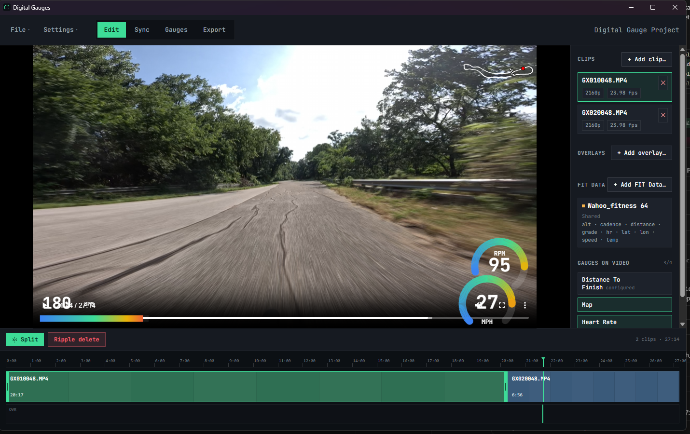

# Digital Gauges

Cross-platform desktop app for adding frame-accurate data overlays —
speed, power, heart rate, GPS, cadence, temperature, altitude, and custom
fields — from FIT data files to action-camera video, then burning the
result into a finished MP4.

Import footage from any action camera and a FIT file — no manufacturer
apps, telemetry extraction, or traditional video editor required.



You bring two things:

- **Action-camera video** from any camera (GoPro, Insta360, DJI, Sony,
  etc.) — used for picture and timing only.
- **A FIT data file** — the source of all gauge data (speed, power, heart
  rate, cadence, GPS, altitude, temperature, …).

No camera-specific software or telemetry extraction is required.

## Brand & terminology

- **Digital Gauges** is the full product name (window title, menus, export
  dialogs, README heading). **DG** is the short acronym for tight spaces
  (icon, favicon).
- Telemetry abbreviations: **HR** (heart rate), **FTP** (functional
  threshold power, gauge zones only), **FIT** (always "FIT file" or "FIT
  data file"), plus **GPS**, **W**, **km/h**, **mph** as-is.
- Marketing copy stays sport-generic: "action-camera video/footage" and
  "FIT telemetry/data" rather than ride- or device-specific terms.

## Tech Stack

- Electron 42 + electron-vite (Vite renderer, Node main)
- React 19 + TypeScript + Tailwind CSS
- Zustand for state
- `fit-file-parser` for FIT
- `ffmpeg-static` + `ffprobe-static` for probe, preview, and export

## Development

```bash
npm install
npm run dev
```

`npm run dev` launches the Electron app with hot-reload on the renderer.

## Building

```bash
npm run build           # creates ./out
npm run build:win       # Windows installer (NSIS)
npm run build:mac       # macOS DMG
npm run build:linux     # AppImage
```

## Project Layout

```
src/
├── main/                  Electron main process
│   ├── extractors/        FIT parsing + ffprobe helpers
│   ├── ipc/               IPC channel handlers
│   ├── export/            FFmpeg burn-in pipeline
│   └── plugins/           User gauge loader (esbuild)
├── preload/               Bridge between main and renderer
├── renderer/src/          React UI
│   ├── components/        Player, editor, timeline
│   ├── gauges/            Built-in gauge React + canvas
│   └── store/             Zustand slices
└── shared/types/          IPC contract types
```

See `docs/writing-gauges.md` for the user-gauge plugin format and
`docs/gauge-templates.md` for saved gauge templates and example presets.

## License

Source code is [MIT](LICENSE). Distributed application builds may include
third-party components with separate licenses; see
[THIRD_PARTY_NOTICES.md](THIRD_PARTY_NOTICES.md).
